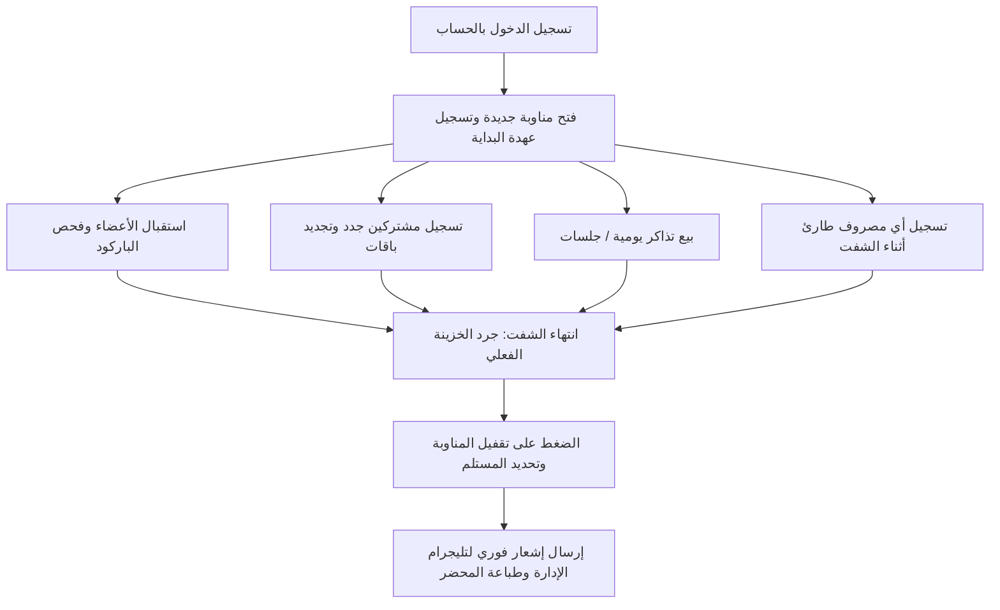

# 🏋️‍♂️ كتالوج ودليل التشغيل الشامل لنظام إدارة THE FIRST GROUP
**الإصدار:** 2.5 (نسخة الإنتاج المتكاملة)  
**تاريخ التحديث:** سبتمبر 2026  
**الجهة:** إدارة منظومة THE FIRST GROUP الرياضية

---

## 📑 فهرس المحتويات
1. [مقدمة عن النظام وهيكله العام](#1-مقدمة-عن-النظام-وهيكله-العام)
2. [الأدوار ومستويات الصلاحيات (RBAC)](#2-الأدوار-ومستويات-الصلاحيات)
3. [دورة العمل اليومية لموظف الاستقبال (Reception Workflow)](#3-دورة-العمل-اليومية-لموظف-الاستقبال)
4. [إدارة الأعضاء والاشتراكات والباقات](#4-إدارة-الأعضاء-والاشتراكات-والباقات)
5. [فحص العضوية وتسجيل الحضور بالباركود](#5-فحص-العضوية-وتسجيل-الحضور-بالباركود)
6. [نظام التذاكر اليومية والـ WorkSpace](#6-نظام-التذاكر-اليومية-والـ-workspace)
7. [إدارة المناوبات (الشيفتات) وتقفيل الخزينة](#7-إدارة-المناوبات-الشيفتات-وتقفيل-الخزينة)
8. [الماليات والحسابات وصافي الأرباح](#8-الماليات-والحسابات-وصافي-الأرباح)
9. [كافيه الصالة (TFG | CAFE) وإدارة المخزون](#9-كافيه-الصالة-tfg--cafe-وإدارة-المخزون)
10. [المساعد المالي الذكي عبر التليجرام (Telegram Financial Bot)](#10-المساعد-المالي-الذكي-عبر-التليجرام)
11. [بوت الواتساب لخدمة العملاء (WhatsApp Bot)](#11-بوت-الواتساب-لخدمة-العملاء)
12. [دليل استكشاف الأخطاء وحلها (Troubleshooting & Emergency)](#12-دليل-استكشاف-الأخطاء-وحلها)
13. [النسخ الاحتياطي وحماية البيانات](#13-النسخ-الاحتياطي-وحماية-البيانات)

---

## 1. مقدمة عن النظام وهيكله العام
تم تصميم وتطوير نظام **THE FIRST GROUP** ليكون منظومة سحابية متكاملة تواكب أحدث المعايير البرمجية لإدارة المنشآت الرياضية، الصالات، الكافيه الملحق، والـ Workspace.
* **قاعدة البيانات:** Google Cloud Firebase / Firestore السحابية المحدثة لحظياً (Real-time Sync).
* **التوافق:** تطبيق ويب تقدمي (PWA) يعمل على أجهزة الكمبيوتر، الشاشات اللمسية، والأجهزة اللوحية، والهواتف الذكية دون الحاجة لتثبيت برامج معقدة.
* **الأمان المالي:** تدقيق مزدوج وحسابات بنكية وخزائن مشفرة مع تسجيل كامل لأي عملية في سجل النشاطات (Audit Logs).

---

## 2. الأدوار ومستويات الصلاحيات
يحتوي النظام على منظومة أمان صارمة تعزل صلاحيات كل مستخدم:
1. **المدير العام (Admin):**
   * الوصول لكافة الإحصائيات، الأرباح، تقارير الشركاء، المرتبات، الإعدادات، وإلغاء/تعديل السندات المالية.
2. **موظف الاستقبال (Employee / Receptionist):**
   * فتح المناوبة اليومية، تسجيل المشتركين الجدد وتجديد الاشتراكات، إصدار التذاكر، تسجيل مصروفات الشفت البسيطة، وتسليم المناوبة وتقفيل الدرج.
   * *محظور عليه:* رؤية صافي أرباح الصالة السنوية، بيانات الشركاء، أو تعديل أسعار الباقات الرئيسية.
3. **كاشير الكافيه (Cafe Staff):**
   * نقطة بيع الكافيه السريعة (POS)، تسجيل المشروبات والوجبات، ومخزون المواد الاستهلاكية.
4. **المدرب (Instructor):**
   * متابعة جدول الكورسات، تسجيل حضور المتدربين في حصصه، ورؤية نسبته/عمولته المعتمدة.

---

## 3. دورة العمل اليومية لموظف الاستقبال



### الخطوات الإجرائية:
1. **بداية الشيفت:**
   * يدخل الموظف على رابط النظام ويسجل الدخول باسم المستخدم وكلمة المرور الخاصة به.
   * ينتقل إلى تبويب **"مناوبتي"**.
   * إذا لم تكن هناك مناوبة مفتوحة، يضغط **"فتح مناوبة جديدة"** ويدخل النقدية الأولية بالدرج إن وجدت (العهدة الافتتاحية).
2. **أثناء الشيفت:**
   * أي عملية قبض (اشتراك أو تذكرة) تضاف فوراً لرصيد الدرج المتوقع.
   * أي مصروف يخرج من الدرج (مثل شراء مياه، أدوات نظافة)، يجب تسجيله فوراً عبر زر **"إضافة مصروف"** مع كتابة البيان بدقة.
3. **نهاية الشيفت:**
   * يقوم الموظف بعدّ النقدية الموجودة في الدرج فعلياً.
   * يضغط على زر **"تقفيل المناوبة / تسليم الشيفت"**.
   * يكتب المبلغ الفعلي الذي تم عده، ويكتب اسم الشخص أو الإدارة التي استلمت العهدة.
   * في حال وجود فارق (زيادة أو عجز)، يقوم النظام بحسابه وإرفاقه في المحضر تلقائياً، ويتم إرسال تقرير فوري لتليجرام الإدارة.

---

## 4. إدارة الأعضاء والاشتراكات والباقات

### إضافة عضو جديد:
1. التوجه لتبويب **الأعضاء (Clients)**.
2. الضغط على زر **"عضو جديد +"**.
3. إدخال البيانات الأساسية: الاسم الرباعي، رقم الهاتف (ضروري لإشعارات الواتساب)، والنوع (ذكر/أنثى)، وأي ملاحظات صحية.
4. النظام ينشئ تلقائياً كود عضوية مميز ورمز باركود خاص بالعميل.

### تفعيل أو تجديد باقة:
1. البحث عن العضو بالاسم أو رقم الهاتف أو كود العضوية.
2. الضغط على **"تجديد / اشتراك جديد"**.
3. اختيار الباقة المطلوبة من قائمة الباقات المعتمدة (مثلاً: شهر حديد، باقة لياقة + كورس، باقة 3 شهور).
4. تحديد طريقة الدفع (كاش، فودافون كاش / إنستاباي، فيزا).
5. كتابة المبلغ المدفوع (يدعم النظام التقسيط أو دفع جزء من المبلغ وتسجيل المتبقي كـ "متبقي آجل").
6. الضغط على **"حفظ وإصدار إيصال"** لطباعة الفاتورة أو إرسالها للعميل.

### تجميد الاشتراك (Freeze):
* في حالة سفر أو مرض العضو، يمكن الدخول لملف العضو والضغط على **"تجميد الباقة"** وتحديد عدد أيام التجميد المسموحة، ليقوم النظام بتعليق احتساب الأيام تلقائياً وتمديد تاريخ الانتهاء.

---

## 5. فحص العضوية وتسجيل الحضور بالباركود
* يحتوي النظام على شاشة فحص ذكية وسريعة في تبويب **"فحص العضوية (Scan)"**.
* **طرق الفحص:**
  1. **قارئ الباركود اليدوي (Barcode Scanner):** توجيه القارئ لكارت العضو أو شاشة موبايله ليتم الفحص في أجزاء من الثانية.
  2. **كاميرا الجهاز:** فتح الكاميرا من داخل المتصفح لمسح الـ QR Code مباشرة.
  3. **البحث اليدوي السريع:** كتابة رقم الهاتف أو الكود.
* **النتائج المعروضة:**
  * 🟢 **أخضر (عضوية نشطة):** تظهر صورة وبيانات العضو مع عدد الأيام المتبقية ويتم تسجيل حضور اليوم تلقائياً بصوت تنبيه ترحيبي.
  * 🔴 **أحمر (عضوية منتهية / ملغاة):** تنبيه فوري باللون الأحمر لمنع الدخول مع خيار توجيه العضو للتجديد.
  * 🟡 **أصفر (باقة مجمدة أو مستحقات مالية متأخرة):** يوضح وجود مديونية على العضو يجب تحصيلها أولاً.

---

## 6. نظام التذاكر اليومية والـ WorkSpace
* **التذاكر اليومية:**
  * للمتدربين الذين يتدربون باليومية أو لحضور جلسة واحدة دون اشتراك شهري.
  * من تبويب **"التذاكر (Tickets)"** -> الضغط على **"قطع تذكرة سريعة"** -> تحديد نوع التدريب -> السداد الفوري وإصدار الباركود لمرة واحدة.
* **مساحة العمل (Work Space):**
  * إدارة حجوزات القاعات والغرف المشتركة بالساعة أو باليوم مع احتساب الوقت والمشروبات أوتوماتيكياً.

---

## 7. إدارة المناوبات (الشيفتات) وتقفيل الخزينة
تعتبر المناوبات حجر الأساس في انضباط الخزينة ومنع أي تلاعب نقدي:
* لا يمكن لعمليات الكاش أن تتم خارج مناوبة مفتوحة ومسجلة باسم موظف مسئول.
* النظام يحسب بدقة رياضية متناهية:
  $$\text{الدرج المتوقع} = \text{العهدة الافتتاحية} + \text{مقبوضات الاشتراكات والتذاكر بالكاش} + \text{الإيرادات الإضافية} - \text{المصروفات النقدية المسجلة}$$
* عند الضغط على **"تقفيل المناوبة"**:
  $$\text{الفارق} = \text{المبلغ الفعلي المدخل} - \text{الدرج المتوقع}$$
  * فارق **0**: الخزينة مطابقة بنسبة 100%.
  * فارق **سالب (-)**: عجز في الخزينة يُسجل على الموظف المسئول.
  * فارق **موجب (+)**: فائض يُسجل في محضر الاستلام.

---

## 8. الماليات والحسابات وصافي الأرباح
تتيح شاشة **"الماليات (Finances)"** للإدارة والشركاء رؤية متكاملة لـ:
1. **إجمالي الإيرادات:**
   * اشتراكات الأعضاء + مبيعات التذاكر + إيرادات الكافيه + العقود والإيرادات الإدارية.
2. **إجمالي المصروفات:**
   * فواتير (كهرباء، ماء، إيجار)، صيانة أجهزة ومعدات، أدوات نظافة، مرتبات الكباتن والموظفين، ومصروفات نثريات.
3. **صافي الأرباح:**
   $$\text{صافي الربح} = \text{إجمالي الإيرادات} - \text{إجمالي المصروفات}$$
4. **سندات القبض والصرف الرسمية:**
   * إمكانية إصدار سند صرف رسمي مالي معتمد برقم تسلسلي لأي مبالغ تخرج من الخزينة الرئيسية للصالة.

---

## 9. كافيه الصالة (TFG | CAFE) وإدارة المخزون
* **نظام نقاط البيع السريع (POS):**
  * شاشة تعمل باللمس لاختيار المشروبات (مياه، بروتين، مشروبات ساخنة، عصائر، سناكس).
  * خيار الدفع كاش أو الخصم المباشر من محفظة العضو إن كان لديه رصيد مسبق الدفع.
* **إدارة المخزون والمشتريات:**
  * تنبيهات عند اقتراب انتهاء كمية صنف معين في الثلاجة أو المخزن (مثل اقتراب نفاد عبوات البروتين).

---

## 10. المساعد المالي الذكي عبر التليجرام (Telegram Financial Bot)
تم ربط النظام ببوت تليجرام رسمي خاص وحصري للإدارة يعمل 24/7 دون توقف:
* **الأمان:** البوت لا يرد إلا على معرف الإدارة المعتمد (Chat ID: `8060299797`) ومحمي بتشفير كامل.
* **الأزرار السريعة التفاعلية:**
  * 📊 **تقرير اليوم الشامل:** ملخص الإيرادات والمصروفات وصافي الربح لليوم.
  * 💰 **صافي الإيراد والأرباح:** صافي أرباح اليوم وصافي أرباح الشهر الحالي حتى اللحظة.
  * 📈 **إجمالي الإيرادات:** تفصيل مقبوضات الاشتراكات والتذاكر.
  * 📉 **إجمالي المصروفات:** بيان ما تم صرفه من الخزينة.
  * 🕒 **الخزينة والمناوبة الحالية:** اسم الموظف المداوم حالياً والنقدية المتواجدة في الدرج الآن.
  * 📅 **تقرير الشهر الحالي:** أرقام الشهر المجمعة.
* **التنبيهات الفورية:** يرسل البوت رسالة تلقائية في اللحظة التي يُقفل فيها أي شيفت مع تفاصيل العهدة والعجز/الزيادة.

---

## 11. بوت الواتساب لخدمة العملاء (WhatsApp Bot)
* الرد الآلي على رسائل واستفسارات العملاء على مدار الساعة.
* إرسال أسعار ومواعيد الباقات والكورسات المتاحة تلقائياً.
* تنبيهات تجديد الاشتراك قبل الانتهاء بـ 3 أيام لحث المشتركين على التجديد.

---

## 12. دليل استكشاف الأخطاء وحلها (Troubleshooting & Emergency)

| المشكلة | السبب المحتمل | طريقة الحل الفورية |
| :--- | :--- | :--- |
| **البرنامج لا يسجل أي عملية أو بطيء** | انقطاع أو ضعف في اتصال الإنترنت | تأكد من اتصال الراوتر؛ البرنامج يدعم التخزين المحلي المؤقت، وسيقوم بمزامنة البيانات تلقائياً بمجرد عودة الاتصال. |
| **وجود عجز في تقفيل المناوبة** | نسيان تسجيل مصروف، أو خطأ في إرجاع الباقي لعميل | راجع سجل مقبوضات الشفت وفواتير المصروفات المدخلة قبل إغلاق المناوبة للتأكد من تسجيل جميع المبالغ. |
| **قارئ الباركود لا يستجيب** | كابل الـ USB غير متصل أو مؤشر الكتابة ليس في خانة البحث | انقر بزر الفأرة داخل خانة البحث بالباركود، ثم أعد المسح. |
| **رسائل التليجرام لا ترد** | توقف خدمة البوت على السيرفر | تشغيل أمر البوت عبر التيرمينال: `npm run telegram-bot`. |
| **نسيان كلمة مرور أحد الموظفين** | خطأ في إدخال الرمز السري | يدخل المدير العام على تبويب **"مستخدمو النظام"** ويقوم بتعيين كلمة مرور جديدة فوراً للموظف. |

---

## 13. النسخ الاحتياطي وحماية البيانات
* يتم نسخ جميع البيانات يومياً وسحابياً عبر خوادم Google Firebase المشفرة.
* لحفظ نسخة احتياطية محلية (JSON Snapshot) على جهاز الكمبيوتر في أي وقت:
  ```bash
  node server/backup-v2-runner.js
  ```
  يقوم هذا الأمر بحفظ نسخة كاملة من جميع الجداول والأعضاء والماليات في مجلد النسخ الاحتياطية.

---
**THE FIRST GROUP Management System — الأداء، القوة، والأمان.**
